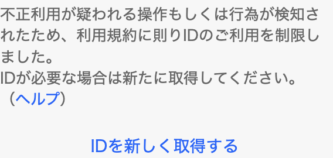
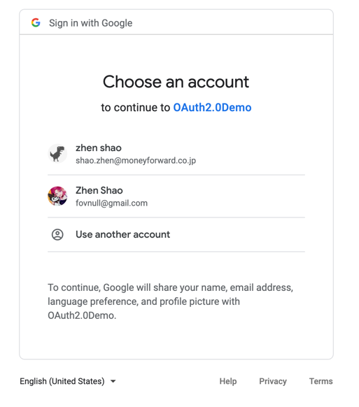
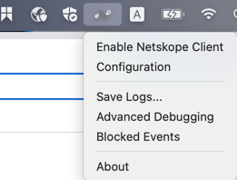

# OAuth2-Google


The demo of [yahoo-auth](https://github.com/Seo-4d696b75/yahoo-auth) is pretty nice. Article: [kibela](https://moneyforward.kibe.la/notes/154599)  
However, my phone number was banned by yahoo.   
**<font color='#FF450'>I AM INNOCENT!</font>**  
  
So I write a demo of google api. Article: [kibela](https://moneyforward.kibe.la/notes/246633) 
The google api SDK wrap most of the functions. I unwrap some logic from SDK to make it easier to understand.  

## Preparation
> active api, set up app, get secret key... refer to [https://developers.google.com/people/v1/getting-started](https://developers.google.com/people/v1/getting-started)  
> api dashboard: [https://console.cloud.google.com/apis/dashboard](https://console.cloud.google.com/apis/dashboard)  
> If you want skip these progress that no matter with OAuth, just ask me to get credential file.

## Authorization
> We can build a request url to get Access Token.   
> AuthService.kt#Line 48: getAccessCredential()  
> I build a `GoogleAuthorizationCodeRequestUrl` object
> We can check the url text from `GoogleAuthorizationCodeRequestUrl` object after build, it looks like this:
```
https://accounts.google.com/o/oauth2/auth?access_type=offline
    &client_id=${}
    &redirect_uri=http://localhost:8080/auth/goopeople
    &response_type=code
    &scope=https://www.googleapis.com/auth/userinfo.profile
```
> Then we redirect to the url above⬆️   
> Then User need to grant to our app  
>   
> After grant, the response looks like:
```
http://localhost:8080/auth/goopeople?code=****************
    &scope=profile+https://www.googleapis.com/auth/userinfo.profile
```

# Access token
> AuthService.kt#Line 96: accessGooglePeople()  
> Build a `GoogleAuthorizationCodeTokenRequest`, we can check the request at `com.google.api.client.auth.oauth2.TokenRequest.executeUnparsed(TokenRequest.java:304)`  
> Make request by SDK. The url looks may like
```
https://oauth2.googleapis.com/token?code=***
    &grant_type=authorization_code
    &redirect_uri=http://localhost:8080/auth/goopeople
    &scope=https://www.googleapis.com/auth/userinfo.profile
```
> Response: 
```
{
     "access_token": "...",
     "expires_in": 3599,
     "refresh_token": "...",
     "scope": "https://www.googleapis.com/auth/userinfo.profile",
     "token_type": "Bearer"
 }
```
# Access data
> Then send request to endpoint `https://people.googleapis.com/`.  
> Request URL:
```
https://people.googleapis.com/v1/people/me?personFields=names
    &access_token=***
```
> I only get name information.   
```
{
  "resourceName": "people/12345678",
  "etag": "%EgUBAi43PRoEBw==",
  "names": [
    {
      "metadata": {
        "primary": true,
        "source": {
          "type": "PROFILE",
          "id": "12345678"
        },
        "sourcePrimary": true
      },
      "displayName": "Zhen Shao",
      "familyName": "Shao",
      "givenName": "Zhen",
      "displayNameLastFirst": "Shao, Zhen",
      "unstructuredName": "Zhen Shao"
    }
  ]
}
```

## Exception
> If the exception `PKIX path building failed: sun.security.provider.certpath.SunCertPathBuilderException: unable to find valid certification path to requested target` occurs.  
> First disable the netskope client  
>   
> If it makes nonsense, add the SSL certificate:
```
$JAVA_HOME/bin/keytool -import -alias ${name} 
    -keystore $JAVA_HOME/lib/security/cacerts -file upload.video.google.com.cer
```
> `upload.video.google.com.cer` in the resources folder